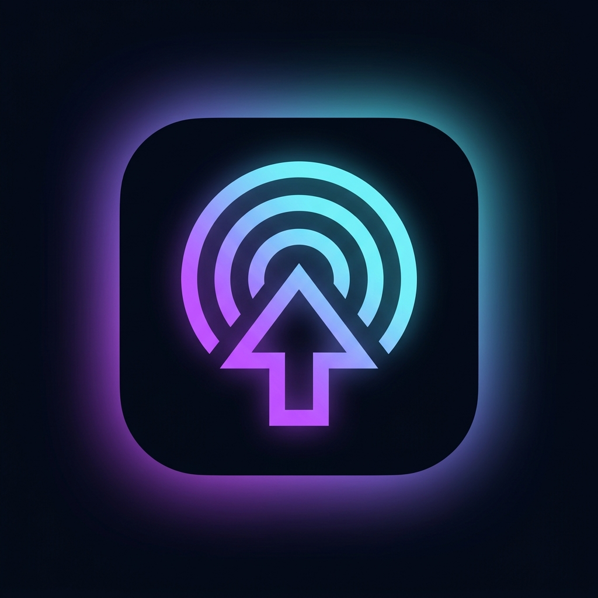

<div align="center">



# ArrDeck

### Mission Control for Your Arr Media Stack

**A Windows desktop dashboard for Sonarr, Radarr, Prowlarr and qBittorrent**

[](https://github.com/CJKaufman/ArrDeck/releases/latest)
[](https://github.com/CJKaufman/ArrDeck/stargazers)
[](https://v2.tauri.app)
[](#-roadmap)

<br />

> 🚧 **Still heavily in development.** A lot is being added, fixed and refined. Feedback, ideas and criticism are very welcome, that's exactly why this is public.

<br />

[**View Landing Page**](https://cjkaufman.github.io/ArrDeck) &nbsp;·&nbsp; [**Download Latest**](https://github.com/CJKaufman/ArrDeck/releases/latest) &nbsp;·&nbsp; [**Report a Bug**](https://github.com/CJKaufman/ArrDeck/issues)

</div>

---

## Why does this exist?

If you run a self-hosted media stack you've probably noticed something: on mobile you're sorted. Android has NZB360, iOS has Lookupeer, and both give you a polished unified interface for your entire arr suite right in your pocket.

On Windows desktop? Nothing. You're stuck juggling five browser tabs, one per service, each with its own UI and its own login. It works, but it's not exactly elegant for something you interact with every day.

I couldn't find a native Windows app that solved this, so I decided to try building one myself. I'm not a professional developer and this is very much a vibe coding project, but it's been a great excuse to learn Tauri, sharpen my React skills, and end up with something I actually use daily.

If you run a similar setup and want something better than browser tabs, give it a go. And if you have ideas, feature requests, or think something is completely wrong, [open an issue](https://github.com/CJKaufman/ArrDeck/issues). Seriously, I want to hear it.

---

## Current State

This is actively being worked on. Core features work but there are rough edges, known bugs, and a lot still to be built. Don't go in expecting a polished finished product.

What currently works:
- Unified dashboard with a draggable, resizable widget grid
- Sonarr and Radarr full library management with grid view, detail drawer and bulk actions
- Prowlarr indexer health monitoring with animated status indicators
- qBittorrent swarm management including torrents, speed controls, file tree and bulk ops
- 6 switchable UI themes
- Unified download queue across all services
- Windows native toast notifications
- Auto-update via GitHub Releases

Still being worked on:
- Layout stability at small window sizes
- Deeper Prowlarr stats and search integration
- Calendar refinements
- Full settings persistence via Tauri store plugin
- Lidarr and Readarr support (architecture is pluggable, just not wired yet)
- First-run onboarding flow
- General polish, error handling and edge cases

---

## Features

| Feature | Description |
|---|---|
| **Unified Dashboard** | Service health, active downloads, upcoming releases and health alerts on one screen |
| **Drag and Drop Grid** | Rearrange and resize every widget in edit mode, layout saves across restarts |
| **Full Library Management** | Browse Sonarr series and Radarr movies with sort, filter, search and bulk actions |
| **Prowlarr Health Rail** | Animated per-indexer status bars in green, amber or red with a sweep animation |
| **qBittorrent Swarm** | Dense torrent table, detail drawer with file tree, per-torrent speed limits |
| **6 UI Themes** | Obsidian, Matrix, Void, Nebula, Glacier and Ghost |
| **Native Performance** | Around 35MB RAM at idle, launches in under half a second. Tauri 2 with Edge WebView2 |
| **Windows Notifications** | Native toast notifications for downloads, health warnings and connection events |

---

## Tech Stack

| Layer | Tech |
|---|---|
| **Shell** | [Tauri 2](https://v2.tauri.app) |
| **Frontend** | React 19 + TypeScript + Vite 6 |
| **Styling** | Tailwind CSS v4 + shadcn/ui |
| **State** | Zustand 5 for UI and settings, TanStack Query v5 for server state |
| **HTTP** | Axios with cookie-jar support for qBittorrent session auth |
| **Charts** | Recharts |
| **Icons** | Lucide React |
| **Runtime** | Edge WebView2, pre-installed on Windows 10 and 11 |

---

## Getting Started

### Download
Grab the latest `.exe` installer from [Releases](https://github.com/CJKaufman/ArrDeck/releases/latest). No Node.js or Rust needed to run it.

### Configure
On first launch go to Settings and enter your service URLs and API keys.

| Service | Default Port | Where to find the API key |
|---|---|---|
| Sonarr | 8989 | Settings > General > Security |
| Radarr | 7878 | Settings > General > Security |
| Prowlarr | 9696 | Settings > General > Security |
| qBittorrent | 8080 | Whatever credentials you set up in its web UI |

---

## Running Locally

```bash
# Needs: Node.js 20+, Rust stable, Edge WebView2 (already on Windows 10/11)

git clone https://github.com/CJKaufman/ArrDeck.git
cd ArrDeck
npm install
npm run tauri dev
```

The app hot-reloads on save. Bug reports, feature ideas and pull requests are welcome. Just keep in mind this is a solo side project so response times may vary.

---

## Roadmap

- [ ] Stable windowed-mode grid at all window sizes
- [ ] Full Prowlarr search and grab history
- [ ] Lidarr support
- [ ] Readarr support
- [ ] First-run onboarding flow
- [ ] Auto-update UI with release notes
- [ ] Better poster image caching
- [ ] Keyboard shortcuts
- [ ] General build pipeline improvements

---

## License

MIT. Use it, fork it, build on it.

---

<div align="center">

Made by [CJKaufman](https://github.com/CJKaufman). Inspired by [NZB360](https://nzb360.com). Built with [Tauri](https://v2.tauri.app).

*Started because I couldn't find what I wanted. Finished when it's actually finished.*

</div>
